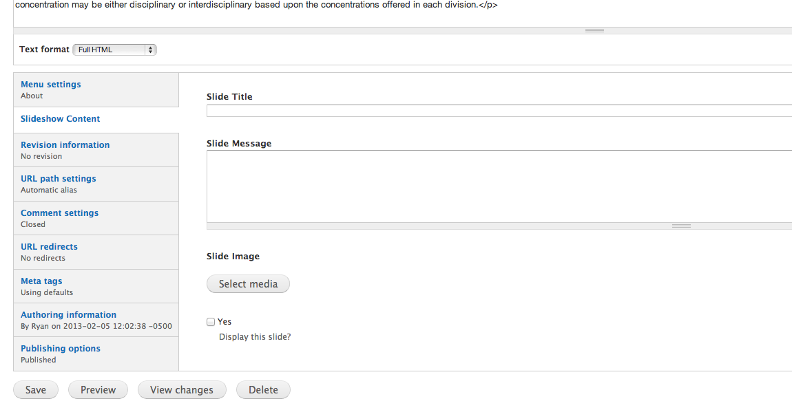

# Creating content is easy

To minimize your need to understand the minutia of making webpages, I've
created a modular system full of sensible defaults. Here is a reference
to the kinds of content you may wish to create and how they differ.

## Aside content

Some pages make use of an additional column of information down the
right side of the page. This content is referred to as an "Aside". When
editing any given basic page you can see a vertical tab at the bottom
ofthe edit page marked "Aside". Clicking that will reveal two fields in
which you can enter content. 

### Single use Aside

If this aside will only be displayed on
when this particular page is displayed, you may enter your content into
the "Aside Content" text area". 

### Shared Aside

If you'd like to share this aside
between multiple pages, you should instead create a "Shared Aside" via
the "Add Content" link and make reference to it via the "Shared Aside"
text box.

## Slides for the Slideshow

### Internal pages

Most slides that will be featured on the home page will link to pages on
[antiochcollege.org](http://antiochcollege.org). All you need to do to
create the slide is edit the page to which it links. At the bottom of
the edit page, there is a "Slideshow Content" region. In this section,
fill in the Slide Title, Slide Message. If you want to create a slide,
but not display it until later, simply leave "Display this slide"
unchecked. 

### External pages

If you wish to create a slide that links to a page on some other site, [Add content](http://antiochcollege.org/node/add)
of type ["External slide"](http://antiochcollege.org/node/add/external-slide)
