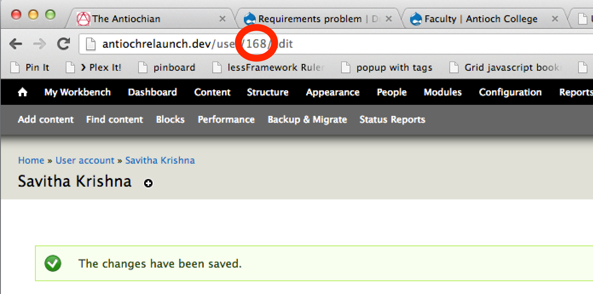

# Creating a Faculty Profile

## Create or add a new user
Make sure the "faculty" Role is checked and make note of the number in the url. This number is the "User Id".

## Create a new faculty profile
Visit http://antiochCollege.org/academics/faculty/[user id]/edit. Input informations and click save.

## If both first and last name do not appear
Edit the user's profile http://antiochrelaunch.dev/user/[user id]/edit/main and save it.
Edit the user's profile http://antiochrelaunch.dev/academics/faculty/[user id]/edit and save it.